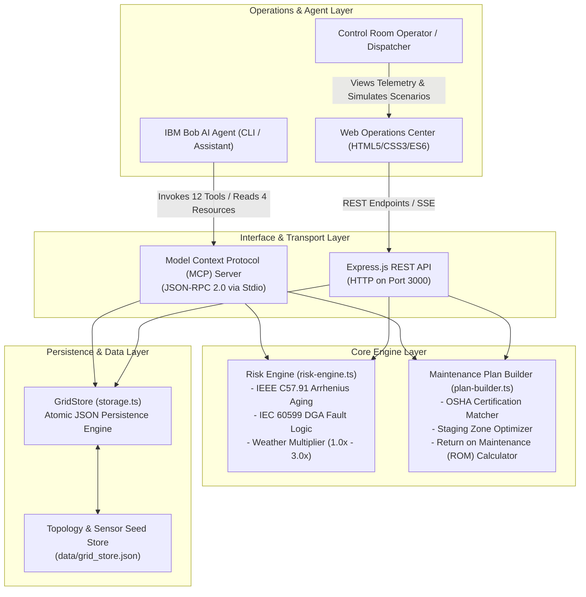

# System Architecture: GridGuard AI

## 1. System Architecture Diagram

---

## 2. System Components

| Component | Technology | Responsibility |
|---|---|---|
| **MCP Server** (`index.ts`) | `@modelcontextprotocol/sdk` | Implements the Model Context Protocol over stdio. Registers 12 schema-validated tools, 4 dynamic resources, and 3 prompt templates for IBM Bob. |
| **Web Operations Center** (`server.ts`, `public/`) | Express.js, Vanilla JS, HTML5, CSS3 | Serves the responsive real-time grid monitoring dashboard, geospatial asset topology map, interactive scenario simulator, and REST API. |
| **Risk Fusion Engine** (`risk-engine.ts`) | TypeScript, Math Engine | Implements IEEE C57.91 Arrhenius thermal aging equations, IEC 60599 multi-gas DGA fault diagnostic logic, and meteorological risk multiplication. |
| **Maintenance Plan Optimizer** (`plan-builder.ts`) | TypeScript, Heuristic Optimizer | Prioritizes assets by failure urgency, assigns crew sizes, matches mandatory OSHA certifications, determines staging zones, and calculates EPRI avoided losses. |
| **Storage & Persistence Layer** (`storage.ts`) | TypeScript, Node.js `fs` | Implements thread-safe, atomic file writes with in-memory caching to guarantee data integrity across asynchronous agent operations. |
| **IBM Bob Skill** (`.bob/skills/grid-resilience/`) | Markdown, Bob Prompt Workflow | Directs IBM Bob's multi-step decision lifecycle: telemetry validation, asset risk ranking, deep-dive diagnosis, feeder switching, and operational handoff. |

---

## 3. End-to-End Data Flow

1. **Telemetry & Weather Ingestion:**
   Sensor readings (temperatures, vibration, partial discharge, oil quality, multi-gas PPM) and regional meteorological forecasts (temperature, wind speed, lightning risk, precipitation, storm warnings) are loaded into `GridStore`.
2. **Deterministic Risk Assessment:**
   When `rank_grid_assets` is invoked by IBM Bob (or via REST `GET /api/risk`), `risk-engine.ts`:
   - Computes baseline physical degradation scores ($0 - 100$) using IEEE and IEC standard thresholds.
   - Evaluates the regional weather risk multiplier ($1.0\times - 3.0\times$).
   - Calculates the overall combined risk score, 7-day failure probability, and remaining action window (in hours).
3. **Contingency Feeder Routing:**
   For high-risk equipment, the engine checks for downstream backup feeds and calculates the switching order to offload customers before failure occurs.
4. **Maintenance Plan & Pre-positioning Generation:**
   `plan-builder.ts` ingests all at-risk assets, groups them by geographic staging zones, allocates certified crews (matching OSHA 1910.269 high-voltage standards), and projects financial savings based on the EPRI benchmark of **$18/customer-hour**.
5. **Operator & Agent Interaction:**
   The dispatcher inspects the live visual heatmap on the Web Operations Dashboard, while IBM Bob autonomously delivers pre-storm briefings and work order exports.

---

## 4. Security Considerations

- **Strict Schema Enforcement:** All tool arguments and API payloads are validated against Zod schemas, mitigating injection vulnerabilities and malformed agent inputs.
- **Credential Protection:** Secrets and environment variables are handled via `.env` (excluded via `.gitignore`), with zero hardcoded API keys in repository files.
- **Human-in-the-Loop Safety:** Breaker tripping and feeder switching sequences are provided as operator guidance documents rather than automated SCADA writes, ensuring licensed dispatchers verify field conditions.

---

## 5. Scalability Beyond Prototype

- **Time-Series Ingestion:** The storage abstraction in `storage.ts` can be swapped from the JSON `GridStore` to TimescaleDB or InfluxDB with zero changes to the MCP tool interfaces.
- **Enterprise SCADA Protocols:** Future iterations can interface directly with utility EMS systems via DNP3, IEC 60870-5-104, or IEC 61850 substation bus adapters.
- **Cluster Deployment:** The Express Web Center and MCP server instances are stateless, allowing horizontal scaling across Kubernetes or Red Hat OpenShift clusters.
